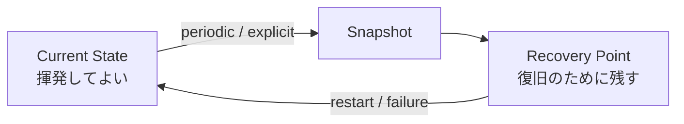
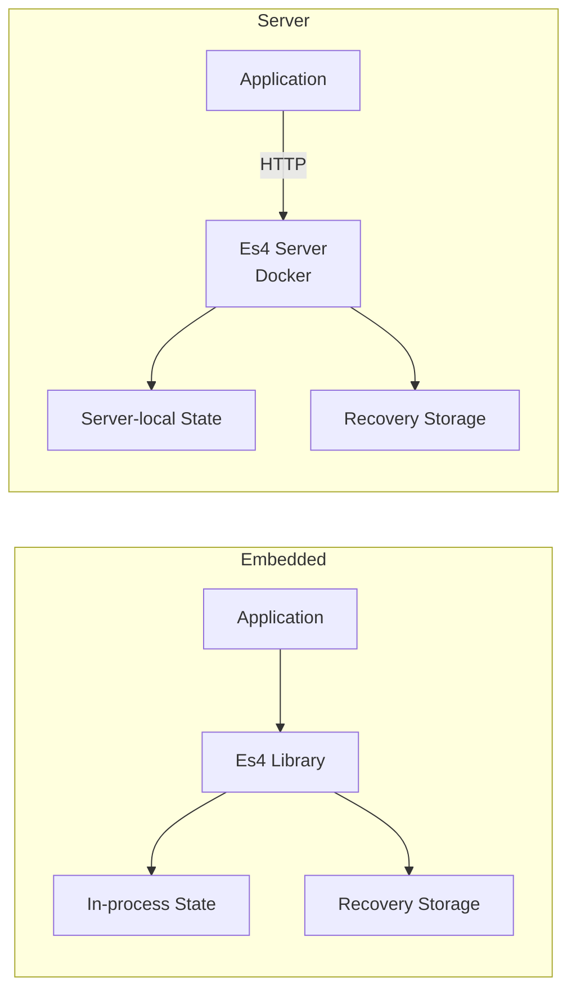

# Es4: An Server-side State Storage

## 技術設計

- インメモリのステートストアと、そのAPI口
- ステートをリカバリするための永続化層
- 上記2層は、アダプター化され、複数のドライバーを設定できる

## アーキテクチャのイメージ(構想段階)

```mermaid
flowchart LR
    STATE["Current State\n揮発してよい"]
    SNAP["Snapshot"]
    REC["Recovery Point\n復旧のために残す"]

    STATE -->|periodic / explicit| SNAP
    SNAP --> REC
    REC -->|restart / failure| STATE
```

## 利用想定

- ライブラリとしての組み込み
- 単独アプリケーション

の両利用を想定

```mermaid
flowchart LR
    subgraph EMBEDDED["Embedded"]
        APP1["Application"]
        ES41["Es4 Library"]
        MEM1["In-process State"]
        REC1["Recovery Storage"]

        APP1 --> ES41
        ES41 --> MEM1
        ES41 --> REC1
    end

    subgraph SERVER["Server"]
        APP2["Application"]
        ES42["Es4 Server\nDocker"]
        MEM2["Server-local State"]
        REC2["Recovery Storage"]

        APP2 -->|HTTP| ES42
        ES42 --> MEM2
        ES42 --> REC2
    end
```
