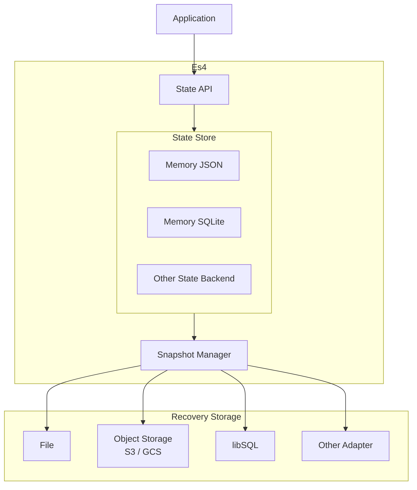
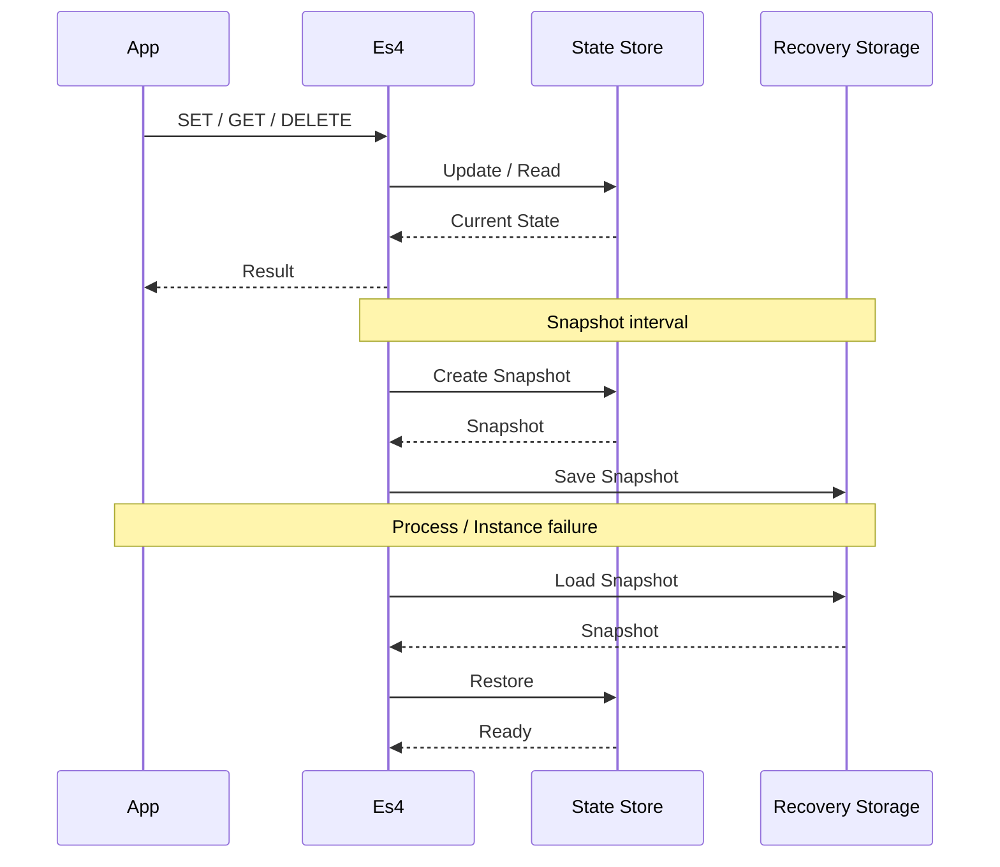
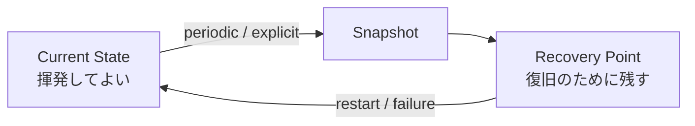
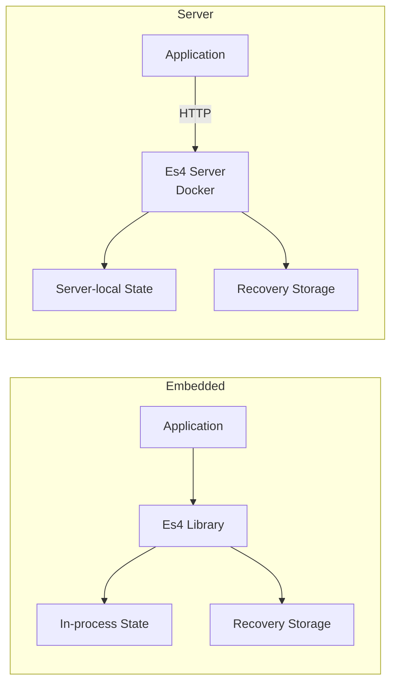

# Es4: An Server-side State Storage

## 開発の同期

- Redis/Valkeyを導入するほどではないが、しかし一定の機能を備えたサーバーサイドステートを持ちたい
- Redisの永続化層のように、インメモリではあるが揮発しない機能が欲しい
- 組み込みと独立、ケースバイケースで実装を選べるようにしたい
- 各層で様々なサービスを選択できるようにしたい(Adapter化)

## 言語

- Go(初期実装)
- Node.js(TypeScript: Go版の実装後)

## 技術設計

- インメモリのステートストアと、そのAPI口
- ステートをリカバリするための永続化層
- 上記2層は、アダプター化され、複数のドライバーを設定できる

## アーキテクチャのイメージ(構想段階)

## ライフサイクル

## 利用想定

- ライブラリとしての組み込み
- 単独アプリケーション

の両利用を想定

## 暫定ロードマップ

### Phase 1 — 最小構成

* インメモリ JSON State
* ファイルベースの Recovery Storage
* Snapshot / Restore
* スナップショット間隔の設定
* 明示的なスナップショット取得
* 起動時の復元
* 永続化なしの Memory-only モード

目標:
State → Snapshot → Recovery というEs4の基本ライフサイクルを確立する。

⸻

### Phase 2 — SQLite State

* インメモリ SQLite State
* SQLiteを利用したスナップショット
* ファイルベースの Recovery Storage
* トランザクション対応
* 並行アクセスへの対応

目標:
構造化されたStateと、より高頻度なState操作に対応する。

⸻

### Phase 3 — 外部 Recovery Storage

* オブジェクトストレージAdapter
    * S3互換ストレージ
* libSQL Adapter
* Litestream連携 / Adapter
* スナップショットの世代管理
* スナップショットの保持ポリシー

目標:
Recovery Storageをローカルファイルシステムから切り離し、外部ストレージへ拡張する。

⸻

### Phase 4 — Es4 Server

* HTTP API
* Dockerイメージ
* 環境変数による設定
* Health / Readiness Endpoint
* 外部 Recovery Storage
* Cloud Runへの対応

目標:
複数のアプリケーション・インスタンスから共有できるState Storeとして利用可能にする。

⸻

### Phase 5 — State Backendの拡張

* その他のインメモリ実装
* その他の組み込みデータベース
* Redis / Valkey Adapter（具体的なユースケースが生じた場合）
* State Backendごとの最適化

目標:
コアアーキテクチャを特定のState Backendに依存させず、柔軟性を拡張する。
