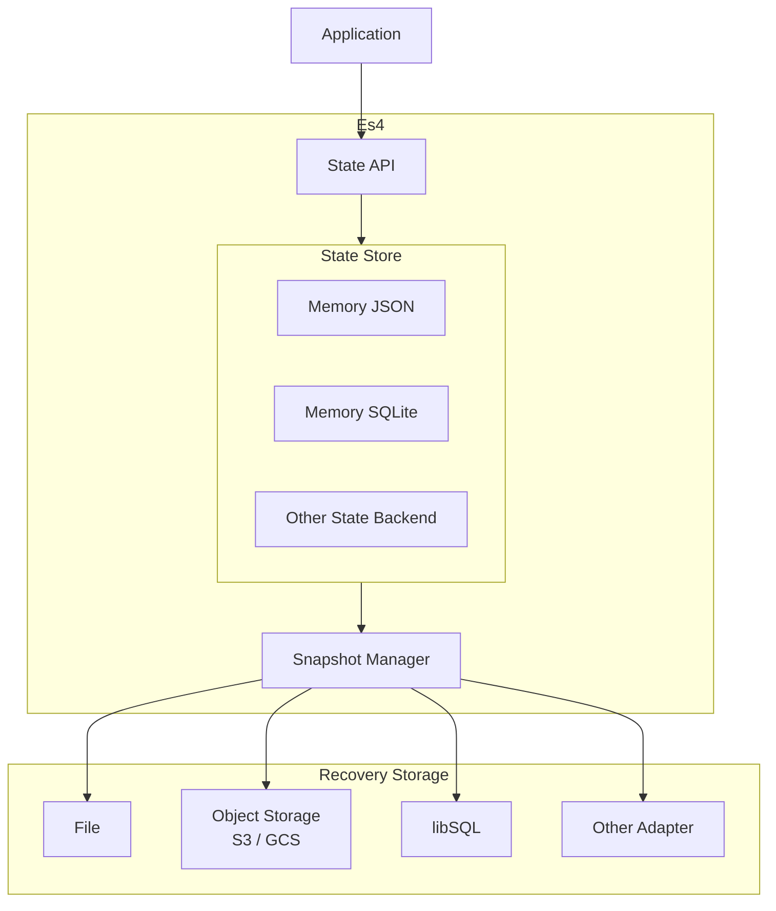
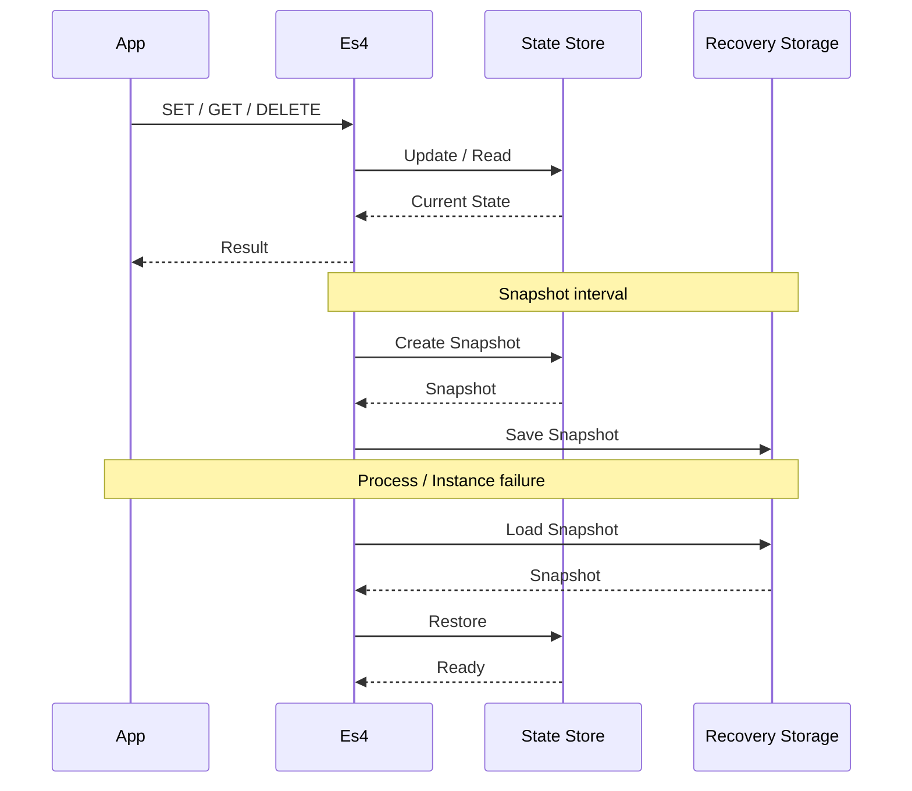
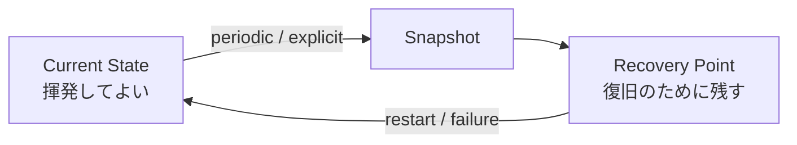
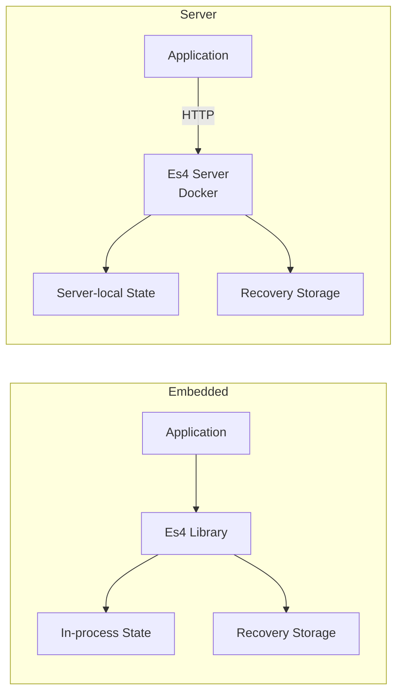

# Es4: A Server-side State Storage

プロダクトの意味的な pillar 正本（目的・スコープ・技術方針のハブ）。  
OKF の版索引は [`index.md`](./index.md)（`okf_version` のみ）。本文はここに書く。

実装前の構想を含む。現行の振る舞い仕様は未着手のため [`specs/`](./specs/) は空。これからやる内容は [`roadmap.md`](./roadmap.md) と [`plans/`](./plans/) を参照。

## 目的・動機（開発の同期）

- Redis/Valkeyを導入するほどではないが、しかし一定の機能を備えたサーバーサイドステートを持ちたい
- Redisの永続化層のように、インメモリではあるが揮発しない機能が欲しい
- 組み込みと独立、ケースバイケースで実装を選べるようにしたい
- 各層で様々なサービスを選択できるようにしたい(Adapter化)

## 言語

- Go（初期実装）
- Node.js（TypeScript: Go版の実装後）

## 技術設計

- インメモリのステートストアと、そのAPI口
- ステートをリカバリするための永続化層
- 上記2層は、アダプター化され、複数のドライバーを設定できる

## アーキテクチャのイメージ（構想段階）

実装済みの現行仕様ではなく、PO が決めた構想図である。

## ライフサイクル

## 利用想定

- ライブラリとしての組み込み
- 単独アプリケーション

の両利用を想定

## 索引

- [roadmap](./roadmap.md) — マイルストーン（Phase 1–5 / 暫定 SemVer）
- [plans](./plans/) — これからやる内容
- [wishlist](./wishlist.md) — PO メモ（未整理）
- [specs](./specs/) — 現行仕様（現状なし）
- [tests](./tests/) — テスト仕様（現状なし）
- [憲章](./charter/) — 開発ルール

----

以上
